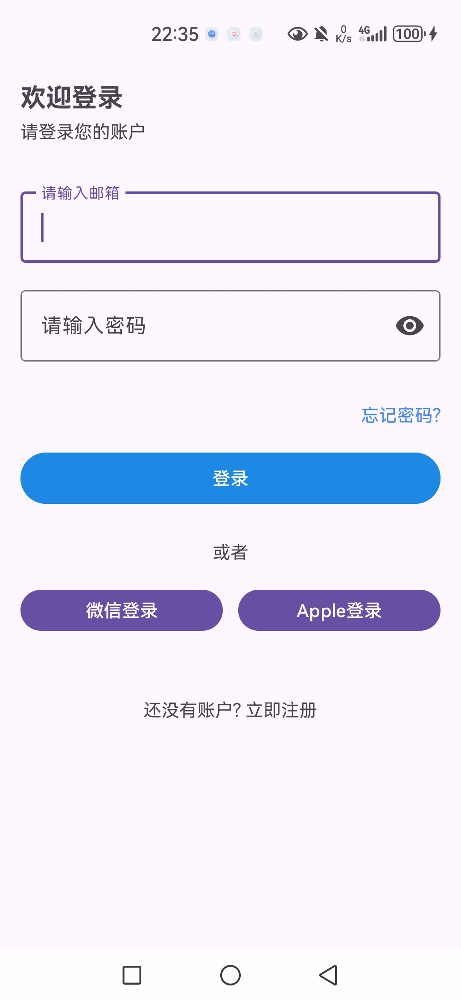
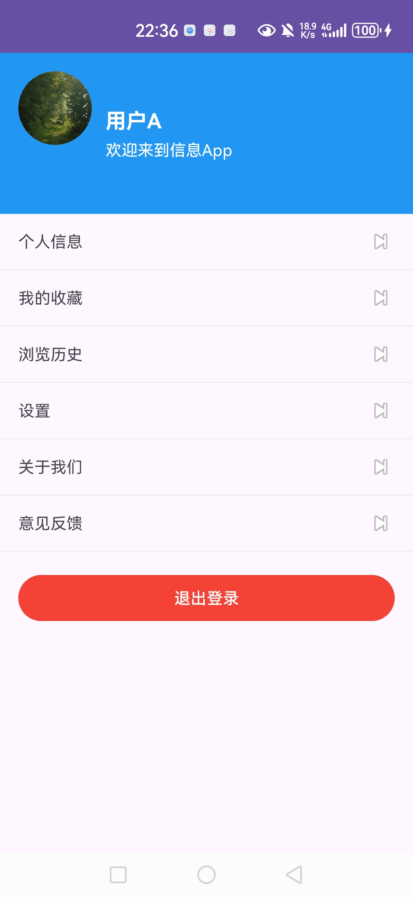
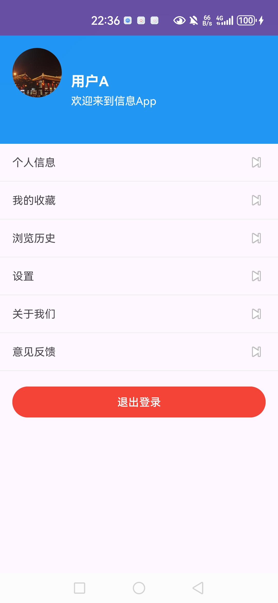

# 登录与个人中心说明

本文档介绍本项目中登录模块与个人中心（头像、退出登录）的实现、关键代码位置、交互流程以及验证方法，并附带三张截图：登录界面、替换头像前、替换头像后。

## 功能概览

- 登录界面使用 `TextInputLayout` 与 `TextInputEditText` 提供更好的输入体验与错误提示。
- 输入校验：
  - 邮箱格式校验（必须符合 `name@domain` 格式）。
  - 密码长度校验（默认不少于 6 位）。
- 账号校验通过后，使用 `SharedPreferences` 持久化登录状态 `logged_in=true`，并保存基础用户信息（如 `username`）。
- 行为：
  - 未登录时，点击进入 `MainActivity`。
  - 已登录时，点击进入 `ProfileActivity`。
- 个人中心头像：支持从相册选择图片并自动居中裁剪为圆形，保存到内部存储，同时记录到 `SharedPreferences` 以便下次启动加载显示。
- 退出登录：在个人中心点击“退出登录”，清除 `SharedPreferences` 的 `logged_in` 标记与相关用户信息，并返回登录页。

## 关键代码位置

- 登录逻辑与校验
  - `app/src/main/java/com/example/demo2/MainActivity.java`
  - `app/src/main/res/layout/activity_login.xml`
- 个人中心与头像
  - `app/src/main/java/com/example/bytedance/ui/ProfileActivity.java`
  - `app/src/main/java/com/example/demo2/ProfileActivity.java`
- 用户数据与校验（SQLite 示例）
  - `app/src/main/java/com/example/demo2/auth/UserDatabaseHelper.java`

## 交互流程

1. 打开应用。
2. 若未登录，进入登录页：
   - 输入邮箱与密码，若格式或长度不符合，错误文案会在 `TextInputLayout` 内联显示。
   - 校验通过后，写入 `SharedPreferences` 并跳转到个人中心页。
3. 在个人中心：
   - 点击头像选择图片，系统相册返回后自动居中裁剪、圆形展示并持久化保存。
   - 点击“退出登录”，清除登录标记并返回登录页；此时返回主界面时底部导航会自动重置选中到 `Home`，缩放效果统一。

## 截图

## 验证步骤

- 登录校验
  - 输入非法邮箱或过短密码，确认错误提示在组件内显示；修正后错误自动消失。
  - 登录成功后，重启应用仍保持登录状态（`SharedPreferences` 生效）。
- 头像裁剪与持久化
  - 从相册选择不同比例图片（横图/竖图/方图），头像均被圆形边界裁剪并居中显示。
  - 重启应用，头像保持显示（内部存储与 `SharedPreferences` 记录生效）。

## 技术要点

- 使用 `TextInputLayout` 的 `setError()` 与 `setErrorEnabled()` 显示/隐藏错误状态。
- 通过 `SharedPreferences` 保存 `logged_in` 与基础用户信息，并在 `MainActivity` 阶段性读取决定导航行为。
- 头像 `ImageView` 设置 `android:scaleType="centerCrop"` 与 `android:clipToOutline="true"`，配合圆形 `drawable` 背景实现圆形裁剪。
